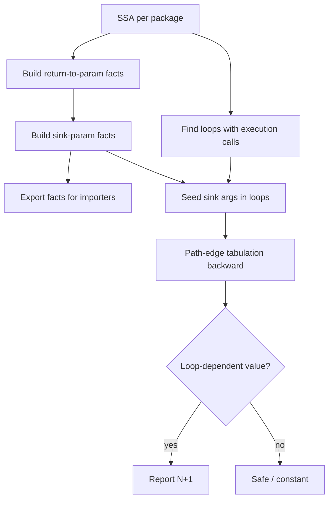

# Onboarding: N+1 Analyzer

This analyzer detects **true, data-dependent N+1 database queries** in Go. The core approach comes from Anders Møller's book [_Static Program Analysis_](https://cs.au.dk/~amoeller/spa/spa.pdf), adapted for GORM-style APIs and cross-package call graphs.

For a shorter product overview, see the root [README](../README.md).

## High-level algorithm

Analysis runs in three conceptual steps:

1. **Find sinks** — find functions that execute queries(we call them sink!)

2. **Find candidate loops** — finding `for` loops whose body contains a query **execution** call (`Find`, `Scan`, `Exec`, etc.) or any function that execute query

3. **Trace dataflow** — From each sink argument inside a loop, walk backward through SSA. If a
   function parameter that used in query change based on loop we mark it as N+1 issue

Unlike a simple "query inside a loop" pattern match, step 3 distinguishes real N+1 issues from safe constant queries.

## Phase 1: Finding sinks

A **sink** is not only a direct GORM call. If `functionA` runs a query and `functionB` calls `functionA`, `functionB` is also treated as a sink (transitive propagation) this was handled in cross-package.go.

This phase does three things:

1. **Find functions that execute or forward query data**
2. **Share summaries with other packages** (the Go analyzer runs per package)
3. **Map return values back to parameters** (for cross-package tracing)

### 1. Direct query sinks

Scan SSA and mark GORM query-builder calls whose arguments should be traced. `getGormSinkArgs` and `isExecutionMethod` in `helper.go` handle this.

- **Query sinks** (arguments traced): Where, Raw, Not, Or, Select, Exec

- **Execution methods** (must appear in a loop body to qualify otherwise will be false positive look code_examples/dynmaic_build): Scan, Find, First, Take, Last

**Example — transitive sink:**

```go
func getUserByID(db *gorm.DB, id int64) (User, error) {
    var user User
    err := db.Table("users").Where("id = ?", id).Scan(&user).Error
    return user, err
}

for _, uid := range userIDs {
    getUserByID(db, uid)
}
```

Inside `getUserByID`, `id` flows into `Where(..., id)` — a query sink argument. The analyzer does not re-scan the function body at every call site. Instead,we summarize it like if you you see `getUserByID` you need to trace id 

Dataflow then walks backward from `uid` to see whether it depends on the loop (e.g. `range userIDs`). If it does, the call is reported as N+1.

### 2. Cross-package facts

Because `go/analysis` analyzes one package at a time, summaries are exported as **facts**:

| Fact                | Purpose                                                  |
| ------------------- | -------------------------------------------------------- |
| `SinkParamFact`     | Parameter indices that eventually reach a query argument |
| `ReturnToParamFact` | Which parameters create each return value                |
| `ExecutorFact`      | Function (transitively) calls a query execution method   |


### 3. Return-to-parameter summaries

```
for _, user := range users {
    id := pkg2.GetUserID(user,userDetailMap)
    pkg1.GetUserHistory(id)   // sink in another package; id must be traced
}
```

Cross-package tracing needs to answer: _"this value came from `pkg2.GetUserID(user)` — from which argument was `id` created?"_

`buildReturnFact` walks each `return` and uses `traceToParams` (another worklist over SSA) to record `ResultToParams`. See the [worklist algorithm](https://martinsteffen.github.io/compilerconstruction/worklistalgos/) reference for the general fixed-point pattern.

**Multi-package example:** `code_examples/multi-package/` — `price_list.go` loops over IDs and calls `product.FetchProduct(id)` in another package. `FetchProduct` runs `Where(..., id).Find(...)`. Facts let the analyzer connect `id` in the loop to the sink in `product`.

## Phase 2: Loop detection

`collectLoopInfo` walks the AST and find `for` loops whose body contains an execution method (directly or via a transitive `ExecutorFact`). and those are seeded for dataflow analysis.

## Phase 3: DataFlow Analysis (IFDS tabulation)

`Phase1_Tabulation` implements path-edge tabulation [IFDS-style](https://www.youtube.com/watch?v=SK0R1kMZLik&t=121s) from book:

1. **Seed** — For each call inside a loop, collect sink arguments via `getCallSinkArgs` (GORM methods or transitive `SinkParamFact`).
2. **Worklist** — Walk backward through assignments, stores, and operands (`applyNormalFlow`).
3. **Cross-package** — At a call result, follow `ReturnToParamFact` to the caller's arguments.
4. **Report** — If the traced value is loop-dependent (`isLoopIndexedAccess`: phi nodes, index with phi), emit a diagnostic via `reportNPlusOneAtSink`.

Constants are pruned early (`*ssa.Const`), so queries with compile-time arguments inside loops are not reported.

## Mental model


